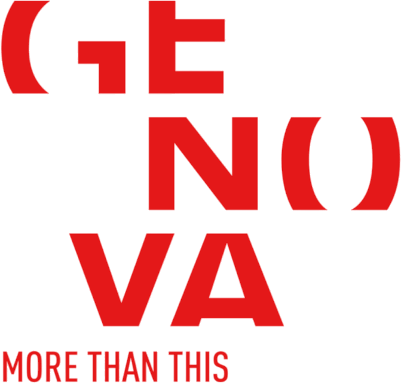
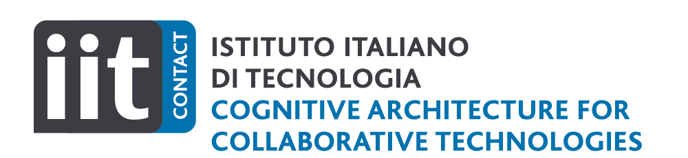
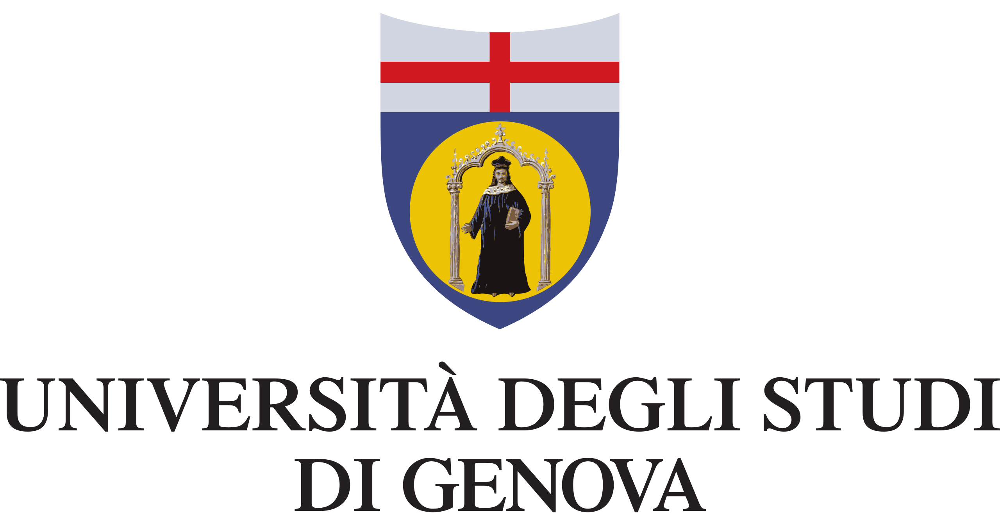
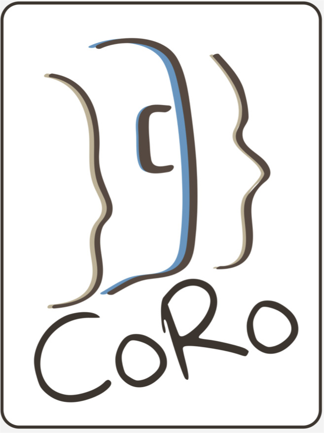

### Workshop Theme & Topics of Interest

The "Robots for Humans" (R4H) workshop bridges the Human-Computer Interaction (HCI) and Human-Robot Interaction (HRI) communities. Emphasizing commonalities and differences, the workshop encourages methodological exchange and explores human-centric design in robotics and computing. Addressing empowerment in robot applications, the workshop seeks theoretical, technical, and design solutions, examining utopian and dystopian perspectives. It invites HRI researchers to tackle challenges, foster inclusivity, and reflect on shaping human-robot interaction visions. Join us to explore the dynamic relationship, strengths, and weaknesses between humans and robots, aiming for thoughtful HRI advancements.

For its first edition, R4H workshop will be help in conjunction with the <a href="https://avi2024.dibris.unige.it/"><b>17th International Conference on Advanced Visual Interfaces</b></a>! (AVI). Join us in Arenzano (Genoa) to explore the intricate bond between humans and robots for thoughtful HRI advancements!

The R4H combines the Human-Computer Interaction (HCI) community with the Human-Robot Interaction (HRI) one. With this workshop, we want to bring together these communities by highlighting the commonalities of the two, stressing their differences, and encouraging the contamination of their methods and results. We aim to do so by recognising that human beings can be the bridge between these two communities and the main objective for a human-centred design approach.

Topics of interests include but are not limited to:
* HCI theories and methods and novel approaches applied to HRI, Cognitive Architectures for HRI.
* Concept papers on the role of technology and robots in empowering or challenging human well-being.
* Empirical studies for human empowerment with technology (e.g., SAR, Health care, educational context).
* Participatory design approaches for HRI applications (e.g., user-centred design for computer and robotic applications, human-centred, and interaction-based design)
* Research methods and challenges for different contexts (e.g., assistive and education) in the HRI field.
* Interaction with virtual or physical embodied agents, human factors and human-in-the-loop in HRI, group dynamics in HRI.
* Design relationship between humans and robots (multi-modal communication, robot personalities, gender robotics, empathy).
* Diversity, power dynamics, gender, racism, social stereotypes and vulnerable targets of users in HRI.
* Trust, acceptance and explainability in HRI; personalisation and end-user development of robot applications.
* Ethical issues (e.g. privacy, misuse and abusive interactions), social risks and fairness in HRI.

---

### Statement of Inclusion, Diversity and Equity

The workshop organizers are committed to creating an inclusive, diverse, and equitable environment for all attendees. We recognize and value the diversity of our attendees and understand that people have different needs and preferences. To accommodate the different time zones of attendees, the workshop will be held in a hybrid format and will be recorded for later viewing. To ensure that all attendees have reliable access to the internet, we will provide technical support and troubleshooting assistance as needed. We encourage attendees from underrepresented groups to submit their work and participate in the workshop. We are committed to creating an equitable and diverse environment, and we are open to suggestions on how to improve the workshop in terms of inclusion and accessibility.

---

### Organizers are affiliated by

<table>
  <tr>
    <!--
    <td>  </td>
    <td>  </td>
    -->
    <td>  </td>
    <td>  </td>
    <td>  </td>
    <td>  </td>
  </tr>
  <!--
  <tr>
    <td>  </td>
    <td>  </td>
    <td>  </td>
  </tr>
  -->
</table>
<table>
  <tr>
    <!--
    <td>  </td>
    <td>  </td>
    -->
    <td>  </td>
  </tr>
  <!--
  <tr>
    <td>  </td>
    <td>  </td>
    <td>  </td>
  </tr>
  -->
</table>

---

<small class="text-muted">Spalsh art designed by Chahin Mohamed. "Scribbly Robot Frands". June, 2021. <a>https://www.artstation.com/artwork/B1PAAk</a></small>

