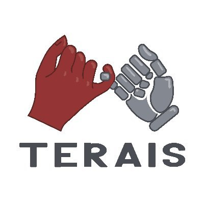

### Workshop Theme & Topics of Interest

Robot for Humans (RfH) is a community-driven workshop where researchers with different backgrounds come together to address an emerging topic through an interactive session. It started in 2024 with its first edition (RfH: let humans be the bridge between computers and robots) at the AVI conference, focusing on exploring the importance of both technical and social aspects of the design and implementation of human-centered robotic solutions. The outcome of such a first edition strengthened the importance of interdisciplinary research and communication between different fields. Drawing on this outcome, the second edition (RfH: empowerment through co-creative and social robots) has been hosted at the RO-MAN conference in 2025. This latter edition focused on designing use cases for robots to empower different human populations. From such a rich experience emerged the topics of children's empowerment and robots as support for human creativity. Following the previous editions, we are proposing the third one with a focus on children’s creativity.

Creativity is a fundamental component of children’s cognitive, emotional, and social development and is widely regarded as a key capability that should be nurtured from an early age. Canonical literature frames creativity as the ability to generate ideas or artifacts that are both novel and useful, yet research increasingly points to a concerning decline in children’s creative abilities during the school years [1]. This “creativity crisis” highlights the need for environments and tools that can actively sustain children’s imaginative thinking and expressive potential. Recent research shows that social robots can act as supportive partners in nurturing and enhancing children’s creativity. Studies in child–robot interaction demonstrate that embodied agents can scaffold creative processes through divergent thinking prompts, adaptive feedback, emotional attunement, and multimodal interaction [2]. In parallel, the field of robotic art has shown how machines can participate in open-ended processes of artistic emergence, revealing how robotic platforms can become sources of creativity [3]. However, existing work in Robot–Art and Human–Robot Co-Creation remains fragmented and has paid limited attention to the specific opportunities and risks that arise when the creators are children. Finally, emerging evidence with neurodivergent populations suggests that personalized and inclusive robot behaviors can lower creative barriers, foster agency, and support the development of diverse creative styles over time [4]. These findings highlight the strong potential of using robots to support children’s creativity. This applies both to neurodivergent children, who may benefit from creative activities that are structured yet expressive, and to neurotypical children, for whom creative engagement is closely tied to well-being and a sense of autonomy [5, 6]. Building on these insights, we argue that creativity not only shapes how children interact with robots but also how they may co-design a robot’s roles, behaviors, and artistic contributions within co-creative systems.

Thus, we aim to organize the third edition of the RfH workshop to discuss the current trends in using robots to increase, empower, and sustain children’s creativity and artistic skills. Moreover, we plan to present questions about crucial aspects to a panel of experts in the field in order to discuss such potential and define a research path for the future. Ultimately, we aim to utilize the discussion that arises from such questions to write a perspective article that explores current trends, research gaps, future challenges, and alternative methods for fostering children’s creativity using social robots.

Topics of interests include but are not limited to:
* Social Robotics for Children’s Creativity in HRI
* Emotion, Personality & Engagement in Creative Contexts for children
* Therapeutic & Assistive Creative in CRI
* Educational & Playful Creative Robotics in CRI
* Advances in Social Robotics and AI for CRI
* Creative Robotics and Artistic Expression
* Diversity of Approaches in Creative HRI
* Benefits and Harms of AI in Creative Contexts in CRI
* Children’s Empowerment Through Creativity and Art in CRI
* Creative Robotics for Neurodivergent or divergent Children
* Creative Robotics for Well-being and Emotional Development
* Robots for Fostering and Sustaining Children’s Creativity
* Creativity-driven learning methods in CRI.
* Creative and participatory design in CRI.

---

### Statement of Inclusion, Diversity and Equity

The workshop organizers are committed to creating an inclusive, diverse, and equitable environment for all attendees. We recognize and value the diversity of our attendees and understand that people have different needs and preferences. To accommodate the different time zones of attendees, the workshop will be held in a hybrid format and will be recorded for later viewing. To ensure that all attendees have reliable access to the internet, we will provide technical support and troubleshooting assistance as needed. We encourage attendees from underrepresented groups to submit their work and participate in the workshop. We are committed to creating an equitable and diverse environment, and we are open to suggestions on how to improve the workshop in terms of inclusion and accessibility.

---

### Supported by

<table>
  <tr>
    <td>  </td>
    <td>  </td>
    <td>  </td>
    <td>  </td>
    <td>  </td>
  </tr>
  <!--
  <tr>
    <td>  </td>
    <td> </td>
    <td> </td>
    <td> </td>
    <td> </td>
    <td> </td>
    <td> </td>
  </tr>
</table>
-->
---
