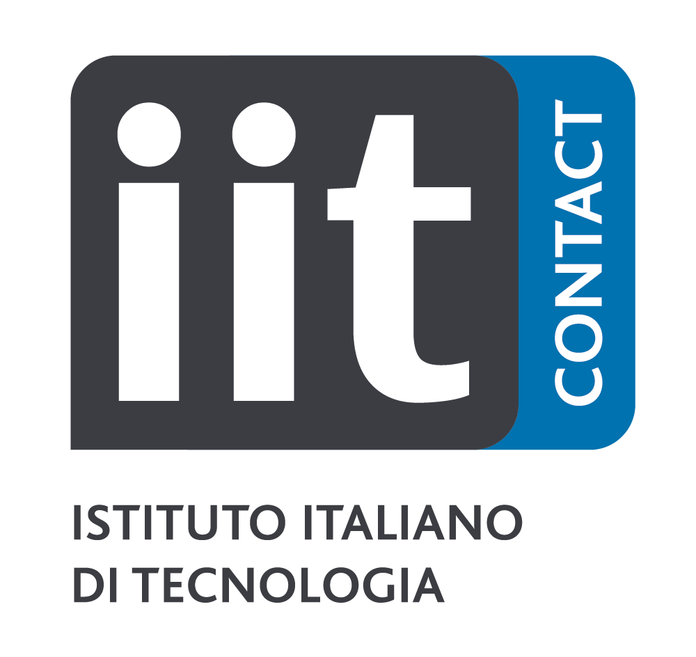

### Workshop Theme & Topics of Interest

The promise of having personal social robots in people’s everyday lives brings a technological, but also sociological, transformation. Researchers need to address complex technical challenges to allow co-robots to autonomously experience people’s environments and interact accordingly. Moreover, different issues have to be addressed as well regarding the role that such co-robots will take on in every aspect of human life. For instance, what makes these machines social? And is their perception as social agents desirable? What dimensions and scales of social life do they cover? Particularly, we are interested in exploring the social robots’ role of empowerment for people.

For example, how can social robots empower humans by augmenting rather than replacing human creativity? This hands-on workshop invites participants to explore new concepts in HRI, looking at the role of social robots in creative domains. The full-day program includes expert keynote speakers, participant poster sessions, and a dynamic co-creative design sprint. Together, we’ll explore timely challenges and opportunities, such as the lack of design guidelines for empowerment and the potential of social robots in creative collaboration. Through an interactive co-creative design sprint, we will engage in a structured process of mapping, sketching, storyboarding, (experiential) prototyping, and discussion.

The workshop offers the opportunity to experiment, connect, and shape the future of HRI to researchers, designers, artists, and developers. Desired outcomes cover social robotics in the direction of designing robots for empowerment and co-creativity, insights into how HRI design choices affect the interaction, socialness, and outcomes on empowerment, and co-creativity. The workshop will conclude with a panel discussion to synthesize findings and discuss general issues related to the role and perception of social robots, working towards guidelines for the design of social robots for creative empowerment.

The edition of the workshop is jointly organized with other two workshops. 

Topics of interests include but are not limited to:
* The role of (mini-c) creativity in the context of "everyday" HRI
* The design of human-robot interactions in art settings
* Social robots for creativity support
* Designing for human-robot co-creativity
* The design of robots with (verbal and non-verbal) social capabilities
* The evaluation of socialness perception in human-robot interactions
* The study of the relationship between human-likeness and socialness
* The application of theoretical principles in applied robotics research
* Design principles for empowerment and inclusion
* Robot adaptive application for marginalised groups;
* Involvement of stakeholders’ perspective in design and implementation.
* AI and LLM application to empower and co-creation in HRI;

---

### Statement of Inclusion, Diversity and Equity

The workshop organizers are committed to creating an inclusive, diverse, and equitable environment for all attendees. We recognize and value the diversity of our attendees and understand that people have different needs and preferences. To accommodate the different time zones of attendees, the workshop will be held in a hybrid format and will be recorded for later viewing. To ensure that all attendees have reliable access to the internet, we will provide technical support and troubleshooting assistance as needed. We encourage attendees from underrepresented groups to submit their work and participate in the workshop. We are committed to creating an equitable and diverse environment, and we are open to suggestions on how to improve the workshop in terms of inclusion and accessibility.

---

### Supported by

<table>
  <tr>
    <td>  </td>
    <td>  </td>
    <td>  </td>
    <td>  </td>
    <td>  </td>
  </tr>
  <tr>
    <td> </td>
    <td> </td>
    <td> </td>
    <td> </td>
    <td> </td>
  </tr>
</table>
---
